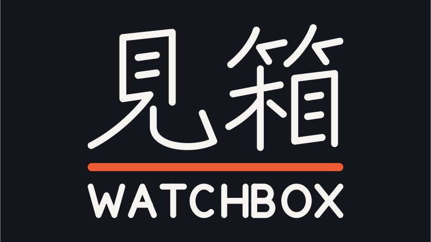

# WatchBox for Android

### 見箱 — a native anime, movie and series client for Android phones, tablets and TV

[](https://github.com/Nicartjay/Watchbox-Android/releases/latest)
[](https://github.com/Nicartjay/Watchbox-Android/releases)
[](https://github.com/Nicartjay/Watchbox-Android/stargazers)
[](LICENSE)
[](https://github.com/Nicartjay/Watchbox-Android/issues)

[](#%EF%B8%8F-get-the-app)
[](#%EF%B8%8F-get-the-app)
[](#-tech-stack)
[](#-tech-stack)

[**Overview**](#-overview) ·
[**Get the app**](#%EF%B8%8F-get-the-app) ·
[**First run**](#-first-run) ·
[**Features**](#-features) ·
[**Downloads**](#%EF%B8%8F-downloads) ·
[**Casting**](#-casting) ·
[**Build**](#-build) ·
[**Architecture**](#-architecture) ·
[**FAQ**](#-faq) ·
[**License**](#-license)

---

## 🎬 Overview

WatchBox is a native Android client for anime, movies and series, written in Kotlin
and Jetpack Compose.

Content comes entirely from **user-installed Aniyomi-compatible extensions**. The app
ships no sources, no extension repository, and hosts no media of its own — it is the
player and the library, and you decide what it reads from.

| 📺 Two real UIs | 🔌 Extension-driven | 📡 Cast anywhere | ⬇️ Watch offline |
|---|---|---|---|
| Separate phone and big-screen builds | Aniyomi lib 12–15 | Chromecast + DLNA | Downloads with subtitles |

> [!NOTE]
> The interface is a deliberate port of
> [NuvioMobile](https://github.com/NuvioMedia/NuvioMobile)'s design system — the same
> tokens, typography, spacing, poster metrics, floating pill navigation and player
> chrome.

---

## ⬇️ Get the app

Grab the latest build from the **[Releases](https://github.com/Nicartjay/Watchbox-Android/releases/latest)**
page. Four APKs per release — pick by **screen size**, then by **architecture**:

| APK | Recommended for |
|---|---|
| 📱 `watchbox-X.Y.Z-arm64-v8a.apk` | Phones — portrait-first, thumb-reachable, touch affordances |
| 📱 `watchbox-X.Y.Z-armeabi-v7a.apk` | Older 32-bit phones |
| 📺 `watchbox-X.Y.Z-tv-arm64-v8a.apk` | **Tablets**, Android TV, Google TV, TV boxes |
| 📺 `watchbox-X.Y.Z-tv-armeabi-v7a.apk` | Older 32-bit TV boxes |

Take **arm64-v8a** unless the device is genuinely old; everything from roughly 2016
onward is 64-bit. Installing the wrong architecture fails at launch rather than at
install, so if the app dies immediately, try the other one.

> [!NOTE]
> The split exists because of FFmpeg. It ships native libraries per architecture —
> `libavcodec` alone is 13 MB each — so a single universal APK carrying every copy came
> to 133 MB. One architecture per APK brings that back to about 35 MB. x86 is not built
> at all: it is emulators and a few retired Chromebooks, both of which run ARM builds
> through translation.

> [!TIP]
> **On a tablet, install the TV APK.** A tablet has the screen area the big-screen UI
> is drawn for: landscape 16:9 cards, a focus-following backdrop, larger posters and a
> left navigation rail instead of a bottom bar. The phone APK on a tablet is just the
> phone layout given more room.

The two use different package names, so **both can be installed side by side** — worth
doing on a tablet to compare before settling on one.

<details>
<summary><b>Two things to know before installing the TV build on a tablet</b></summary>

Neither of these is a bug:

- **It is landscape-only.** Locked to `sensorLandscape`, so it will not rotate to
  portrait. If you hold your tablet in portrait, use the phone APK.
- **Affordance is focus-based, not touch-based.** Taps work — every control is
  genuinely clickable — but the highlight and scale follow *focus*, and ripples are
  switched off because they are invisible at three metres. A tap therefore acts
  without lighting up. With a keyboard, remote or D-pad attached, it behaves exactly
  as it does on a television.

</details>

<details>
<summary><b>Switching between the two builds</b></summary>

The in-app updater picks its APK from the build's own form factor, decided at compile
time, and from the device's own architecture, and matches release assets by filename. A
tablet running the TV build therefore keeps getting TV builds, which is what you want.
It also means:

- Switching between them is a manual uninstall and reinstall — the differing package
  names make them separate apps, not an upgrade path. Library and settings do not
  carry across.
- Renaming release assets by hand sends devices the wrong build. Both the `-tv` marker
  and the architecture suffix are load-bearing.
- A 64-bit device falls back to a 32-bit build where only that was published, but never
  the reverse: the wrong architecture fails at load rather than at install.

</details>

**Requirements:** Android 7.0 (API 24) or newer, on ARM. `targetSdk` is 36. x86 is not
built — see the note above.

> [!TIP]
> WatchBox checks GitHub Releases for new versions and can update itself from
> **`Settings → Check for updates`**.

---

## 🚀 First run

**The app ships with no extension repository.** Bundling one would decide on your
behalf which third-party index the app fetches from, so you add your own:

1. Open an `aniyomi://add-repo?url=...` link — repositories advertise themselves this
   way and the app adds them automatically, **or**
2. paste the URL under **Settings → Extension repositories**.

Both the repository root and a direct link to its `index.min.json` are accepted; they
normalise to the same entry. Multiple repositories can be configured and switched on
or off independently.

---

## ✨ Features

| Area | What it does |
|---|---|
| 🏠 **Home** | Spotlight carousel drawn at random from every installed source, a Featured rail, Continue Watching, My List, and one rail per source |
| 🔍 **Search** | Debounced search across every source at once, grouped per source, or narrowed to one |
| 🧭 **Browse** | Popular and latest per source, with filters and a button that opens the source's own site |
| 🧩 **Extensions** | Multiple repositories, each switchable; filter by language, adult content and repository; per-extension settings; load failures surfaced rather than hidden |
| 📄 **Detail** | Parallax hero, collapsing floating header, expanding action row, episode list in blocks of fifty for long runs, a Videos tab of TMDB trailers, where-to-watch by country, studio logos, reviews, and source metadata parsed out of markdown |
| ▶️ **Player** | Media3/ExoPlayer with HLS, DASH and progressive files, quality/subtitle/speed pickers, episode switcher, aspect cycling, gesture seek, brightness and volume swipes, lock mode |
| ⬇️ **Downloads** | Episodes and films kept for offline viewing, with subtitles; quality chosen per download; pause, resume and cancel; storage usage and an SD-card option |
| 💬 **Subtitles** | Online search and download; size, background style, outline width, colour and opacity; and timing correction measured from the video itself — adjustable from Settings or inside the player |
| 📡 **Casting** | Chromecast and DLNA in one list, with a header-injecting local proxy and a Web Video Caster hand-off |
| 📚 **Library** | My List, in-progress, full watch history, and Downloads |
| ⚙️ **Settings** | Seven accent themes, display scaling, auto-play-next, repository management, subtitle appearance and provider, download storage and concurrency, 18+ toggle |
| ⬆️ **Updates** | Checked once a day on launch, prompting to install or skip — the APK is fetched and handed to the system installer |

<details>
<summary><b>📺 Android TV and tablets — a separate build, not a stretched layout</b></summary>



- **Leanback launcher entry** with the banner above — a TV launcher draws no label
  beside the tile, so the artwork has to carry the name itself
- **Left navigation rail** that expands on focus, replacing the bottom pill — which
  sat inside the overscan region a television can physically crop
- **Backdrop that follows focus**, using TMDB backdrops and title logos; landscape
  16:9 cards rather than portrait posters
- **Full D-pad navigation**, with focus visible at three-metre viewing distance
- **Remote playback control** — left and right seek ±10s while the controls are
  hidden, with an on-screen readout; directional seek on the timeline when they are
  showing; media transport keys; and Back that hides the controls before leaving
- **Skip button takes focus** when it appears, so OK skips an opening without
  aiming at anything
- **Voice search**, because typing a title with a remote is nobody's preference

</details>

<details>
<summary><b>📱 Phones — and what happens on a tablet</b></summary>

The phone build carries the touch layout: bottom pill navigation, portrait posters,
single-pane detail. It also adapts upward if you run it on a tablet anyway — a
navigation rail and two-pane detail above 1000dp, with column counts and padding
scaling from one shared definition. Nothing is broken there; it is simply the
smaller-screen design given more room.

</details>

---

## ⬇️ Downloads

Press the download icon on an episode row — or beside **Play** for a film, which has no
episode list to carry one — pick a server, and it downloads for offline viewing.
Finished downloads appear under **Library → Downloads** and play with no network at all.

**Two engines, chosen by format.** This is not a preference; each covers what the other
cannot:

| Stream | Engine | Pause / resume | Survives a restart |
|---|---|---|---|
| Progressive file (MP4, MKV) | Media3 | yes | yes |
| HLS, DASH | FFmpeg | no | no |
| Served via the extension's own proxy | FFmpeg | no | no |

Media3's segment downloader issues each segment, key and variant playlist as its own
request, and several CDNs behind HLS refuse those however the headers are applied — while
the same stream plays perfectly. FFmpeg reads the manifest and pulls the whole graph in
one session, which is what works. The cost is that an ffmpeg session is a single process
invocation with no resume point, so those downloads restart rather than continue.

Subtitles come down with the video. Where the source supplies its own they are muxed into
the file — those are cut for that exact release. Where it supplies none, the download
prompt offers what is available online and lets you proceed without one.

<details>
<summary><b>What to expect, and why</b></summary>

- **Quality is asked for, not assumed.** Source labels advertise anything from 850 MB to
  66 GB for one episode, so choosing silently risks most of a phone's free space.
- **A segmented download shows a percentage from a duration probe**, not a byte total: a
  manifest declares no total size until it finishes.
- **Progressive downloads can pause; segmented ones cannot.** The control offers cancel
  instead, rather than appearing to pause and discarding the transfer.
- **Long-press cancels an unfinished download** and discards what it wrote. Tap keeps its
  own meaning, so cancel needs a separate gesture.
- **Storage can be an SD card** where the device has one — useful on a TV box with 16 GB
  internal. Switching does not move existing files, and a download on a card that has been
  removed is reported as unavailable rather than deleted.
- **Wi-Fi only is the default**, and applies to both engines.
- **Concurrency is one by default**, adjustable to five. More is not always faster: past a
  couple of downloads the connection is the limit and everything slows together.

</details>

> [!WARNING]
> **A source that streams through its own in-process proxy can still fail.** Some
> extensions return a `localhost` URL on a port chosen fresh each session; FFmpeg is used
> for exactly that reason, but if a server answers with something that is not media —
> usually an error page served with HTTP 200 — the download fails where playback would
> have worked. Another server for the same episode generally does.

---

## 📡 Casting

Two protocols, listed together in one picker:

- **Chromecast** — via the Cast SDK and `MediaRouter`, using Google's Default Media
  Receiver (`CC1AD845`)
- **DLNA/UPnP** — via SSDP discovery and SOAP AVTransport

Casting is **pull-based**: you hand the receiver a URL and it opens its own connection.
Neither Cast's `LOAD` nor DLNA's `SetAVTransportURI` carries request headers, so a
receiver cannot send the `Referer` that extension CDNs require. A local proxy therefore
relays those streams — the TV fetches from your phone, and your phone fetches upstream
with the headers. Streams needing no headers skip the proxy entirely.

<details>
<summary><b>Details that are easy to get wrong</b></summary>

Each of these silently returns zero devices, or plays nothing at all:

- **`NEARBY_WIFI_DEVICES` is required on Android 13+.** Without it the router reports
  no routes. It is requested when the cast panel opens.
- **A multicast lock is required for SSDP.** Android's Wi-Fi driver filters multicast
  in hardware without one, and SSDP is entirely multicast.
- **The SSDP socket must join the multicast group.** Several Samsung and LG models
  reply to the group rather than the requester, so a plain `DatagramSocket` never
  sees them.
- **HLS manifests must be rewritten at every level.** A receiver fetches segments,
  variant playlists and encryption keys itself.
- **The segment format must be declared.** A Cast receiver assumes MPEG2-TS; handed
  fragmented MP4 without being told, it reports the duration, downloads segments and
  never renders a frame.
- **Subtitle format differs per protocol.** Chromecast accepts only WebVTT; DLNA
  renderers are built around SubRip and commonly ignore WebVTT. The proxy converts to
  whichever the receiver wants.

</details>

> [!WARNING]
> **Most DLNA TVs cannot play HLS.** That is a receiver limitation — those sources
> generally need Chromecast, or the Web Video Caster hand-off. Seeking is also limited
> on proxied HLS, because the proxy deliberately does not advertise byte-range support
> for rewritten manifests.

**Chromecast needs genuine Google Play Services.** Devices with a sideloaded or
spoofed GMS register no cast route providers, so no Chromecast will ever be found.
DLNA works there, since it needs no Google services.

---

## 🔌 How extensions work

This is the part worth understanding before changing anything.

Aniyomi-family extension APKs are compiled `compileOnly` against the Aniyomi source
API and **bundle none of it**. Disassembling one shows a single class extending
`eu.kanade.tachiyomi.animesource.online.AnimeHttpSource` — which is not in the APK.
It is resolved at runtime from the host, so **this app is the extension runtime
library**.

Three consequences:

1. **The `eu.kanade.tachiyomi.*` tree is a fixed ABI.** Class names, member names,
   signatures and even Kotlin file-facade names (`RequestsKt`, `OkHttpExtensionsKt`)
   are load-bearing. Renaming any of them still compiles, then fails at runtime with
   `NoSuchMethodError`.
2. **Dependency versions are constraints, not preferences.** rxjava 1.3.8, okhttp
   5.3.2, jsoup 1.22.1 and `androidx.preference` are what extensions were compiled
   against.
3. **R8 must be told to keep all of it.** Nothing references the tree statically, so
   R8 deletes it by default — the first release build shipped 4,861 classes and zero
   `eu.kanade.tachiyomi` ones while the debug build worked fine.

Two checks guard this, both wired into CI:

```bash
python3 tools/verify-extension-abi.py               # compiled classes
python3 tools/verify-release-abi.py <release.apk>   # after minification
```

**Supported API:** library versions **12–15**. Lib 16 is deliberately rejected — it
made `getSeasonList` abstract and replaced the video contract with `Hoster`, so a 16
extension would call members this app does not implement.

<details>
<summary><b>Known limitations</b></summary>

- **Cloudflare-protected sources will not work.** Solving those needs a WebView to run
  the JS challenge. `cloudflareClient` exists for ABI compatibility but is not a
  solver, so affected sources fail rather than hang.
- **Extensions are private to this app.** Stored in internal storage rather than
  installed system-wide, which avoids needing `REQUEST_INSTALL_PACKAGES` and
  `QUERY_ALL_PACKAGES` — but means they are not shared with other Aniyomi clients.
- **No tracker sync.**
- **Downloads depend on the source.** A stream Media3 cannot fetch goes through FFmpeg
  instead, which covers HLS, DASH and proxied streams — but a server answering with
  something that is not media fails where playback would not. See
  [Downloads](#%EF%B8%8F-downloads).

</details>

---

## 🛠 Build

Requires **JDK 17** and the Android SDK (platform 36, build-tools 36.0.0).

```bash
git clone https://github.com/Nicartjay/Watchbox-Android.git
cd Watchbox-Android

# Point Gradle at your SDK
echo "sdk.dir=$HOME/Library/Android/sdk" > local.properties

# Phone build, or :app:assembleTvDebug for TV and tablets
./gradlew :app:assembleMobileDebug
```

APKs land in `app/build/outputs/apk/mobile/debug/` and `app/build/outputs/apk/tv/debug/`,
one per architecture — `app-tv-arm64-v8a-debug.apk` and `app-tv-armeabi-v7a-debug.apk`.
Take the arm64 one unless the device is 32-bit.

Task names are flavor-aware: `assembleRelease` does not exist — use
`assembleMobileRelease` / `assembleTvRelease`.

<details>
<summary><b>Configuration</b></summary>

Everything has a working default, so no configuration is needed to build.

| Key | Default | Purpose |
|---|---|---|
| `WATCHBOX_REPO_URL` | yuzono/anime-repo | Seed for `BuildConfig.DEFAULT_REPO_URL` |
| `WATCHBOX_VERSION_NAME` | current version in `app/build.gradle.kts` | Version name |
| `WATCHBOX_VERSION_CODE` | `1` locally; CI run number in releases | Version code |
| `TMDB_API_KEY` | a working shared key | Artwork and metadata enrichment |

Nothing reads `WATCHBOX_REPO_URL` at runtime any more, since repositories are added by
the user. It survives as a build constant for forks that want to hardcode one.

</details>

<details>
<summary><b>Releasing</b></summary>

`.github/workflows/release.yml` builds minified release APKs — four of them, two form
factors times two architectures — and publishes them. Run it from the **Actions** tab
with one of three modes:

| Mode | Effect |
|---|---|
| `dry-run` | Build only; APK uploaded as a workflow artifact |
| `draft` | Build and create a **draft** GitHub Release |
| `publish` | Build and publish the Release |

Pushing a `v*` tag (e.g. `v4.9.9`) publishes automatically and takes the version from
the tag name. `versionCode` comes from the workflow run number so it always increases,
which Android requires for in-place upgrades. A local build defaults to `1`, so a
locally built APK will not install over a released one.

**Signing.** The release keystore (`release.jks`) is committed, with store/key password
and alias both `watchbox`. That is deliberate, and the reason is upgrade compatibility
rather than secrecy: Android refuses an update whose signature differs from the
installed copy, and a debug-key fallback cannot work in CI because every runner
generates its own debug key.

The trade-off is that anyone can build an APK Android treats as an update to this one.
Fine for a personal build. To move the key into CI secrets, set
`WATCHBOX_KEYSTORE_BASE64`, `WATCHBOX_KEYSTORE_PASSWORD`, `WATCHBOX_KEY_ALIAS` and
`WATCHBOX_KEY_PASSWORD` — when all four are present they override the committed
keystore. Changing keys breaks in-place upgrades for existing installs.

The workflow fails the build if an APK ends up debug-signed, so a dead-end release
cannot be published by accident.

</details>

---

## 🏗 Architecture

Single-module Android app, no Kotlin Multiplatform. Plain layering with a hand-rolled
service locator (`AppContainer`) instead of Hilt or Koin.

```
app/src/
├── main/kotlin/                  Shared by both builds
├── mobile/kotlin/                Phone entry point
└── tv/kotlin/                    TV screens + leanback manifest and banner

app/src/main/kotlin/
├── eu/kanade/tachiyomi/          THE EXTENSION ABI — do not rename
│   ├── animesource/              AnimeSource, AnimeHttpSource, models
│   └── network/                  NetworkHelper, Requests, interceptors
└── space/nicart/watchbox/
    ├── cast/                     Chromecast + DLNA transports, discovery, proxy
    ├── core/ui/                  Design tokens, theme, type scale
    ├── data/local/               DataStore: history, watchlist, settings, repos
    ├── domain/                   UI models + AnimeRepository
    ├── download/                 Two engines, registry, storage, foreground services
    ├── extension/                Loader, classloader, repo index, installer
    └── ui/                       home, browse, detail, player, search, library,
                                  settings, extensions, components, navigation
```

<details>
<summary><b>Notable choices</b></summary>

- **Parent-last classloading.** Extensions bundle their own copies of common
  libraries, so their dex is searched before the host's — with a parent-first fallback
  on `LinkageError`, since a few only link that way.
- **Every extension call is guarded.** Third-party code runs in-process and is linked
  at runtime, so failures arrive as `NoSuchMethodError` rather than `Exception`. One
  bad source degrades to an empty rail instead of taking down the feed.
- **Per-source search results.** Relevance is not comparable across sources, so
  merging would bury good matches.
- **Identity is `sourceId` + source-relative `url`.** There is no global id in this
  ecosystem, and titles change between fetches.
- **Subtitles are drawn in Compose, not by Media3's `SubtitleView`.**
  `SubtitlePainter` hardcodes the outline to 2dp and `CaptionStyleCompat` exposes no
  width, so an outline-width setting is impossible without rendering the cues.
- **Subtitle timing is corrected against a parsed cue list, not the player's.**
  `Player.Listener.onCues` reports a line as it becomes current, which can delay one
  but can never surface one early, so a negative offset is unrepresentable that way.
  WebVTT and SubRip are parsed in-app; ASS/SSA keeps the player's own rendering,
  since its timing sits inside `Dialogue` records alongside styling.
- **Brotli is decoded explicitly.** OkHttp negotiates only gzip, while the default
  User-Agent claims a current Chrome — so a server may answer `content-encoding: br`
  with HTTP 200 and the undecoded bytes reach the extension as a parse failure that
  looks like the source being broken.
- **A TMDB search hit is verified before it is trusted.** A wrong match is cached and
  never reconsidered, so a candidate must match exactly or differ only by a season
  marker; a bare prefix is rejected, which is what separates "Monster Season 2" from
  "Monster Musume".
- **Trailers hand off to the YouTube app rather than playing in-app.** Every TMDB video
  is a YouTube link and the payload carries no stream URL, so Media3 cannot play one. The
  package is named explicitly, because a plain `ACTION_VIEW` goes to whichever app holds
  the default for `youtube.com` — the browser, on many devices — and that needs a
  `<queries>` entry, since Android 11+ filtering makes `setPackage` unresolvable rather
  than merely unpreferred.
- **Availability is resolved from the network, not the device locale.** A locale reflects
  the language the user chose, so an English-language phone in Manila reports US and would
  list the wrong catalogue. Cloudflare's trace endpoint answers in 234 bytes with no API
  key and no location permission.
- **Episode blocks live with the season selector.** Computed a level above it, the blocks
  described every season's episodes combined while the filter ran inside — so on an
  18-season show they selected episodes that were never in the list.
- **One TMDB request per detail page, not seven.** `append_to_response` folds videos,
  providers, reviews, keywords, ratings, alternative titles and external ids into the same
  payload for the same rate-limit cost.
- **Two download engines, split by format.** Media3's segment downloader could not fetch
  the HLS these sources serve — each segment, key and variant playlist is its own request,
  and the CDNs refused them however headers were applied, while the same stream played
  fine. FFmpeg reads the manifest and pulls the graph in one session. Progressive files
  stay on Media3, which keeps pause and resume-after-restart that an ffmpeg session cannot
  offer.
- **A download is keyed by episode, and its filename hashed.** Stream URLs are signed and
  expire within minutes, so a cache keyed by URL could never find a finished download
  again. The key carries the episode URL, which some sources fill with a whole session —
  hashing keeps the filename inside the 255-byte limit without two episodes of one show
  colliding, which truncating would cause silently.
- **The filesystem is the authority for a download, not the registry.** A remuxed file is
  a plain file no index knows about, so reconciliation checks it on disk; judging it by
  Media3's index deleted finished downloads while their video sat there orphaned.
- **Two flavors rather than one combined APK.** A single build carrying both
  `LAUNCHER` and `LEANBACK_LAUNCHER` works, but ships the TV UI to every phone and
  makes the two impossible to install side by side.
- **Form factor is tracked separately from width.** A 1080p television and a 1080p
  tablet report near-identical dp widths yet need opposite treatments: the TV is read
  at three metres with a D-pad and needs *fewer, larger* targets.
- **Cast SDK calls are marshalled to the main thread.** `RemoteMediaClient` guards 56
  methods with `checkMainThread`, and so do `CastContext.getCastState` and
  `SessionManager.getCurrentCastSession`. Never return an SDK object from that hop —
  only a resolved value, or the guard fires on the next dereference.

</details>

<details>
<summary><b>Testing</b></summary>

```bash
./gradlew :app:testMobileDebugUnitTest :app:testTvDebugUnitTest
```

1148 unit tests, run in CI. They deliberately cover only pure logic whose failures are
*silent* on a device — HLS URI rewriting, DLNA SOAP envelopes, subtitle parsing and
conversion, subtitle sync arithmetic, cast stream selection, gesture maths, remote key
mapping, filter application, deep-link parsing, TMDB title matching — because those
break in ways that look like missing data rather than errors. Anything better checked
by looking at the screen is not unit-tested.

A few pin things that are otherwise invisible: the mangled JVM names of the
`kotlin.time.Duration` rate-limit overloads extensions link against, the list keys that
Compose treats as fatal when repeated, and — from bugs that reached a device — that a
download filename stays inside the filesystem's length limit without two episodes of one
show colliding, and that reconciliation never drops a download the other engine owns.

</details>

---

## 🧰 Tech stack

Kotlin 2.1 · Compose BOM 2025.05 · Material 3 · Navigation-Compose (typed routes) ·
Media3 1.6 · ffmpeg-kit 1.17 · Ktor 3.1 · Coil 2.7 · DataStore · kotlinx.serialization ·
play-services-cast 22 · androidx.mediarouter 1.7

**Extension runtime:** okhttp 5.3.2 (+ brotli) · rxjava 1.3.8 · jsoup 1.22.1 ·
Injekt · androidx.preference

---

## ❓ FAQ

**Does WatchBox host or stream any content?**
No. It ships no sources and hosts nothing. All content comes from extensions you
choose to install, from repositories you choose to add.

**Which APK should I download?**
Phones: `watchbox-X.Y.Z-arm64-v8a.apk`. Tablets, Android TV and TV boxes:
`watchbox-X.Y.Z-tv-arm64-v8a.apk`. On a tablet the TV build is the better experience.
Take `armeabi-v7a` only on a genuinely old 32-bit device — the wrong architecture fails
at launch rather than at install.

**Why are there no extensions after installing?**
The app ships with no repository on purpose — see [First run](#-first-run).

**Why does a source show nothing?**
Most often the source is Cloudflare-protected, or its host is unreachable. Failures
are surfaced per source rather than hidden, so the rail reports rather than silently
emptying.

**Chromecast finds no devices — why?**
Chromecast discovery needs genuine Google Play Services. Devices with a sideloaded or
spoofed GMS register no cast routes at all. DLNA still works.

**Can I watch downloads with no connection?**
Yes. A finished download plays from disk with no network and no call into the extension,
whether opened from Library → Downloads or from the title's own page.

**Why can I pause some downloads but not others?**
A progressive file is fetched by Media3, which can pause and resume it. HLS and DASH go
through FFmpeg, which has no resume point — those offer cancel instead, rather than
appearing to pause and quietly discarding the transfer. See
[Downloads](#%EF%B8%8F-downloads).

**Why is the APK so much larger than it used to be?**
FFmpeg's native libraries. They are what make HLS and DASH downloadable at all. Releases
are split per architecture so you install one copy rather than four.

**Can I install both builds at once?**
Yes — different package names, so they coexist. They do not share library or settings.

---

## ⚠️ Disclaimer

> [!IMPORTANT]
> **WatchBox is a client interface.** It ships no sources and does not host, store or
> distribute any content.

- **Content** — everything is provided by extensions the user chooses to install. The
  app is not affiliated with those extensions or the sites they read from.
- **Third-party code** — installing an extension runs third-party code inside this
  app's process, with its network access. Only install extensions from repositories
  you trust.
- **Responsibility** — users are responsible for how they use the app and any
  third-party services they interact with, and for complying with applicable law and
  copyright. Concerns about an extension belong with its author, not this project.

---

## 📜 License

Released under the **[GNU GPL-3.0](LICENSE)**, which is required rather than chosen:
the design system is ported from GPL-3.0 code, and the GPL is copyleft.

In short — you may use, study, modify and redistribute this, including commercially,
provided derivative works stay under the GPL-3.0 and ship their source. See
[`LICENSE`](LICENSE) for the terms that actually govern.

### Credits

- **[NuvioMobile](https://github.com/NuvioMedia/NuvioMobile)** (GPL-3.0) — the design
  system: colour tokens, spacing scale, typography, poster metrics, navigation pill
  and player chrome.
- **[Aniyomi](https://github.com/aniyomiorg/aniyomi)** (Apache-2.0) — the extension
  ABI reproduces its interface so existing extensions can link against it. The
  implementation is this project's own, written against signatures observed in
  published extension APKs; no Aniyomi source was copied.
- **Typeface** — JetBrains Sans (Apache-2.0).
- **Metadata and artwork** — [TMDB](https://www.themoviedb.org/). This product uses
  the TMDB API but is not endorsed or certified by TMDB.

---

<div align="center">

**WatchBox**

[⭐ Star the repo](https://github.com/Nicartjay/Watchbox-Android) ·
[⬇️ Download](https://github.com/Nicartjay/Watchbox-Android/releases/latest) ·
[🐛 Report an issue](https://github.com/Nicartjay/Watchbox-Android/issues)

</div>
